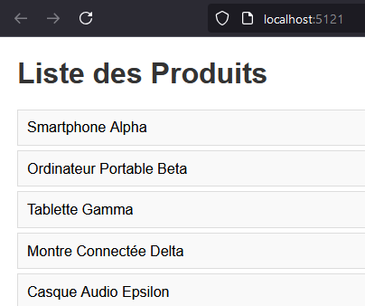
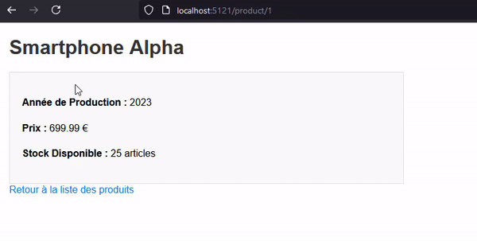
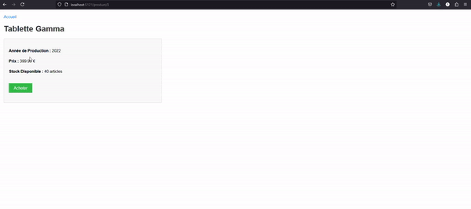

# Practical Work with Node.js

## Project Structure

```
docker-node-docker/
│
├── app.js
├── package.json
├── package-lock.json          # Generated automatically after `npm install`
├── Dockerfile
├── .dockerignore              # (Optional but recommended)
│
├── views/
│   └── temp_exemple.pug
│
├── public/
│   └── code/
│       └── jquery.min.js
│
├── images/
│   └── listdesproduitstp1ex1.png # Image for ex1q1
│
├── gifs/
│   └── ex1q2.gif                # GIF for ex1q2
│
└── node_modules/              # Generated automatically after `npm install`
```

## Setting Up the Project

1. **Create the Project Directories**:
   ```sh
   mkdir -p mon-projet/views
   mkdir -p mon-projet/public/code
   mkdir -p mon-projet/images
   mkdir -p mon-projet/gifs
   ```

2. **Add jQuery Library**: 
   - Download the jQuery file from: [jQuery 3.7.1](https://cdnjs.cloudflare.com/ajax/libs/jquery/3.7.1/jquery.min.js) and save it in the `public/code/` directory.

3. **Initialize Node.js Project**:
   ```sh
   cd docker-node-docker/
   npm init -y
   ```

4. **Install Dependencies**:
   ```sh
   npm install express pug
   ```

## Docker Configuration

1. **Build Docker Image**:
   ```sh
   docker build -t docker-node-docker .
   ```

2. **Run Docker Container**:
   ```sh
   docker run -d -p 5121:5121 --name docker-node-docker-container docker-node-docker
   ```

3. **Access the Container** (optional, for debugging or inspection):
   ```sh
   docker exec -it docker-node-docker-container /bin/bash
   ```

## Branch Management

1. **Switch to Docker Environment Branch**:
   ```sh
   git checkout -b CreateTheDockerEnvironment origin/CreateTheDockerEnvironment
   ```
   
   This will set up a new branch `CreateTheDockerEnvironment` that tracks `origin/CreateTheDockerEnvironment`.

## My Progress

In this section, you can track progress made throughout the project.

### Exercise 1, Question 1 (ex1q1)


### Exercise 1, Question 2 (ex1q2) and question3 (ex1q3)


### Exercise 1, Question 4 (ex1q4)


### Exercise 1, Question 5 (ex1q5)

### Exercise 1, Question 6 (ex1q6)


## Additional Notes

- Ensure that Docker is running on your system to build and run the container.
- The `views/` folder contains `.pug` files for templating, and the `public/` folder holds static files such as JavaScript.
- The `images/` folder contains images that can be used in your application.
  - Image for `ex1q1` is `listdesproduitstp1ex1.png`.
- The `gifs/` folder contains animations that can be used for visual effect.
  - GIF for `ex1q2` is `ex1q2.gif`.
- The `Dockerfile` should define how the Docker image is built and include the necessary configuration to expose port 5121.

## Useful Commands

- **Stop the Docker Container**:
  ```sh
  docker stop docker-node-docker-container
  ```

- **Remove the Docker Container**:
  ```sh
  docker rm docker-node-docker-container
  ```

- **Remove the Docker Image**:
  ```sh
  docker rmi docker-node-docker
  